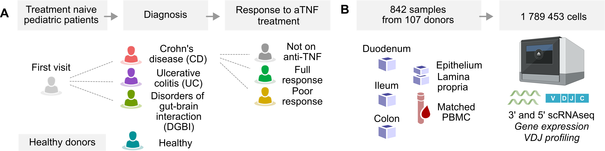

# Analysis of scRNAseq data from T cells in the PREDICT study

This repository contains analyses of single-cell RNA sequencing data from gut biopsies and peripheral blood mononuclear cells (PBMCs) collected from children with Crohn's disease (CD), ulcerative colitis (UC), disorders of gut-brain interaction (DGBI), and healthy donors within the PREDICT study.

The manuscript is currently in development. For related work, please see:

* [Concerted changes in the pediatric single-cell intestinal ecosystem before and after anti-TNF blockade, eLife, 2023](https://elifesciences.org/reviewed-preprints/91792#tab-content)
* [Divergent T Cell Phenotypes Define Pediatric Crohn’s Disease and Ulcerative Colitis, medRxiv, 2025](https://www.medrxiv.org/content/10.1101/2025.10.16.25336112v1)

## Data Availability

Processed single-cell datasets are publicly available through the Broad Institute Single Cell Portal.

### Gut datasets

* **SCP3739** – *Local and circulating cytotoxic CD4 T cells are early markers of disease activity in pediatric Crohn's disease: Gut CD3 and NK Cells*  
  https://singlecell.broadinstitute.org/single_cell/study/SCP3739/

* **SCP3741** – *Local and circulating cytotoxic CD4 T cells are early markers of disease activity in pediatric Crohn's disease: Gut CD4 T Cells*  
  https://singlecell.broadinstitute.org/single_cell/study/SCP3741/

### Blood dataset

* **SCP3737** – *Local and circulating cytotoxic CD4 T cells are early markers of disease activity in pediatric Crohn's disease: Blood Data*  
  https://singlecell.broadinstitute.org/single_cell/study/SCP3737/

## Repository Structure

The analysis is organized into six Jupyter notebooks:

| Notebook | Description |
|-----------|-------------|
| `01_Processing_3p_data.ipynb` | Processing, quality control, and annotation of 10x Genomics 3′ scRNA-seq datasets. |
| `02_Processing_5p_data.ipynb` | Processing, quality control, and annotation of 10x Genomics 5′ scRNA-seq datasets. |
| `03_Atlas.ipynb` | Construction and analysis of the integrated T-cell atlas. |
| `04_Other_datasets.ipynb` | Analysis of external and validation datasets used in the study. |
| `05_GSEA_analyses.ipynb` | Gene set enrichment and pathway analyses. |
| `06_Cohort_characteristics.ipynb` | Clinical cohort characteristics and associated statistical analyses. |

## Requirements

Running the code requires R version 4.2.1 or higher. Specific package versions may be required; please refer to the `sessionInfo()` output included in each notebook for details.

## Instructions

Clone the repository and download the processed datasets from the Broad Single Cell Portal links above. The notebooks can then be executed sequentially following the workflow described in the **Repository Structure** section.

Raw sequencing data will be deposited in a public repository upon publication of the manuscript.
